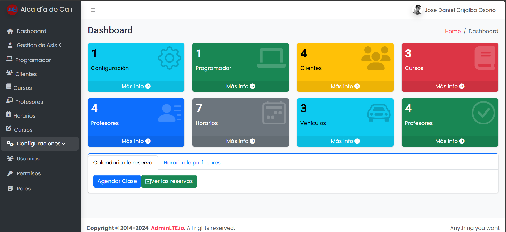
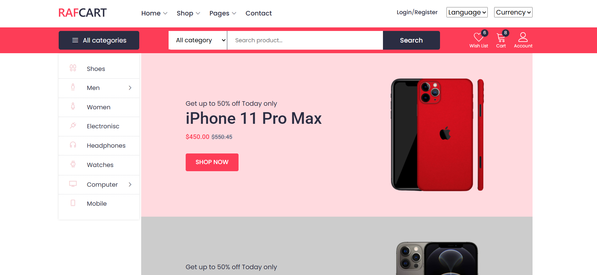

`URL: `https://jose-daniel-g.github.io/1_store_angular/


#### `Angular 18.2.21  TypeScript Version 5.5.4`

# AdminLTE + Angular Integration

Este proyecto integra **AdminLTE** con **Angular** para crear un sistema de administración moderno y dinámico.

## 📋 Descripción

AdminLTE es una plantilla de administración de código abierto basada en Bootstrap 4/5. En este proyecto, hemos integrado AdminLTE con Angular para aprovechar la modularidad y dinamismo que ofrece Angular junto con el diseño atractivo de AdminLTE.

## 🚀 Características

- **Diseño Moderno**: Interfaz visualmente atractiva proporcionada por AdminLTE.
- **Modularidad de Angular**: Componentes y rutas reutilizables.
- **SPA (Single Page Application)**: Navegación rápida sin recargar la página.
- **Personalización Fácil**: Edición de estilos, temas y estructura.

## 🛠️ Requisitos Previos

Asegúrate de tener instalados los siguientes programas antes de empezar:

- **Node.js**: >= v14
- **Angular CLI**: >= v15
- **Git*#

 ng g c components/employees
 ng g s service/data 
 
ng generate service services/userdata
ng g component components/user --standalone
ng build --configuration production
ng generate module app-routing --flat --module=app
ng generate component modules/home --skip-tests 

#### Frontend-Store ADD Adminlte
```
npm install admin-lte bootstrap @fortawesome/fontawesome-free
npm install jquery --save
npm install --save-dev @types/jquery
```
###### Deploy Angular en GitHub Pages

1. **Revisar el `angular.json`**  
   - Ir a:  
     ```json
     "projects": { "frontend-store": {
     ```
   - Ese es el **nombre de tu proyecto**.  
   - En la sección `build > options`, agrega (debajo de `outputPath`):  
     ```json
     "baseHref": "/frontend-store/"
     ```
---

2. **Instalar la herramienta de despliegue (si no está instalada)**  
   ```bash
   npm install -g @angular/cli
   ng add angular-cli-ghpages
   ng build --configuration production --base-href "/1_store_angular/"
   ng deploy --base-href="/1_store_angular/"
   ```
   ---
  "styles": [
    "node_modules/bootstrap/dist/css/bootstrap.min.css",
    "node_modules/@fortawesome/fontawesome-free/css/all.min.css",
    "node_modules/admin-lte/dist/css/adminlte.min.css",
    "src/styles.css"
  ],
  "scripts": [
    "node_modules/jquery/dist/jquery.min.js",
    "node_modules/bootstrap/dist/js/bootstrap.bundle.min.js",
    "node_modules/admin-lte/dist/js/adminlte.min.js"
  ]
  ---
   #### CONFIG ANGULAR.JSON
   - De lo contrario si ya esta en angular.json configurado
   ```bash
   ng build --configuration production 
   ng deploy

   ```
   *Configurar GitHub Pages en GitHub*

   **Ir a tu repo en GitHub → Settings > Pages.**

   - Seleccionar:

   - Branch: gh-pages

   - Folder: / (root)

   - Guardar. 
  ```
  npm i --save-dev @types/bootstrap
  npm install bootstrap jquery jquery-ui-dist slick-carousel line-awesome jquery-nice-select
  ```
### VERSIONS 

```
ng version
npx tsc -v
npm install @ngx-translate/core@latest @ngx-translate/http-loader@latest
ng add @angular/localize

```